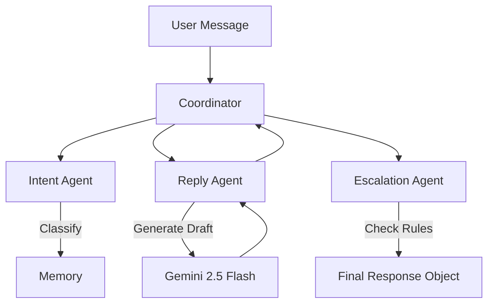

# 🤖 Customer Support Agent (Google AI SDK + ADK)

A production-ready AI customer support agent built using **Google's Gemini 2.5 Flash model** and the **Agent Development Kit (ADK)**. This system is designed to automate Level 1 support tasks, categorizing user intent, assessing urgency, and generating human-like responses while maintaining a strict escalation protocol for sensitive issues.

---

## � Table of Contents

1.  [Project Overview](#-project-overview)
2.  [Key Features](#-key-features)
3.  [System Architecture](#-system-architecture)
4.  [Installation & Setup](#-installation--setup)
5.  [Usage Guide](#-usage-guide)
6.  [Project Structure Details](#-project-structure-details)

---

## 🚀 Project Overview

The **Customer Support Agent** solves the problem of high support volume by acting as an intelligent first line of defense. Instead of static chatbots, this agent uses Large Language Models (LLMs) to understand context, tone, and specific customer needs.

**What it does:**

- **Listens** to customer queries via CLI or API.
- **Analyzes** the message to determine _Intent_ (e.g., Billing, Support) and _Urgency_ (Low, Medium, High).
- **Decides** whether to answer directly or flag for human intervention.
- **Responds** with a polite, context-aware message generated by Gemini.

---

## ✨ Key Features

### 1. 🧠 Intelligent Intent Classification

The agent doesn't just match keywords. It uses semantic understanding to classify messages into categories like:

- `technical_issue`: Login problems, bugs, errors.
- `billing`: Invoice questions, refund requests.
- `general_inquiry`: Feature questions, pricing info.

### 2. 🚨 Dynamic Urgency Scoring

Every message is scored for urgency.

- **Low**: "How do I change my avatar?"
- **High**: "Your system deleted my data! I'm losing money!" (Triggers Escalation)

### 3. 🛡️ Safety & Escalation Protocols

The agent includes a dedicated `EscalationAgent`. If a user expresses extreme frustration, threatens legal action, or reports a critical outage, the system automatically flags the conversation for a human supervisor (`escalation: True`).

### 4. ⚡ Powered by Google ADK

Built on the **Agent Development Kit**, ensuring:

- **Traceability**: You can see exactly _why_ the agent made a decision.
- **Modularity**: Agents are separated into specialized components.
- **Debuggability**: Use the ADK Inspector to visualize the conversation flow.

---

## 🏗️ System Architecture

The project follows a **Coordinator-Worker** pattern:



1.  **Coordinator**: The central brain that manages the workflow.
2.  **Intent Agent**: First pass analysis—what does the user want?
3.  **Reply Agent**: The creative writer—using the intent to draft a helpful response.
4.  **Escalation Agent**: The safety officer—reviewing the situation for risk.

---

## 🛠️ Installation & Setup

### Prerequisites

- Python 3.10 or higher
- A Google Cloud API Key (Get it from [Google AI Studio](https://aistudio.google.com/))

### Step 1: Clone & Install

```bash
# Install dependencies
pip install -r requirements.txt
```

### Step 2: Configure Environment

Security is built-in. We use a `.env` file so you never hardcode API keys.

1.  Create a file named `.env` in the root folder.
2.  Add your key:
    ```env
    GOOGLE_API_KEY=AIzaSy...YourKeyHere
    ```

---

## 🎮 Usage Guide

### 1. Quick Test (CLI)

The fastest way to test the agent's brain.

```bash
python app.py "My credit card was charged twice!"
```

**Output:**

```json
{
  "intent": "billing",
  "urgency": "high",
  "reply": "I apologize for the double charge. I can certainly help you reverse that...",
  "escalation": { "escalate": true, "note": "Potential billing dispute" }
}
```

### 2. Run the API Server

Ideal for connecting to a frontend (React, Vue) or mobile app.

```bash
python app.py --server
```

- **Endpoint:** `POST http://127.0.0.1:8000/ask`
- **Body:** `{"message": "Hello world"}`

### 3. Visual Debugger (ADK)

See the agent "think" in real-time.

```bash
adk web --port 8000 --no-reload
```

- Open **http://localhost:8000**.
- Select `cust_support` agent.
- Chat with the agent and view the trace logs for each step.

---

## 📂 Project Structure Details

| File/Folder          | Purpose                                                               |
| :------------------- | :-------------------------------------------------------------------- |
| `app.py`             | **Entry Point**. Handles CLI arguments and starts the FastAPI server. |
| `customer_agent/`    | **Core Logic**. Contains the separate agent modules.                  |
| ├── `coordinator.py` | Orchestrates the flow between agents.                                 |
| ├── `intent.py`      | Classifies user messages.                                             |
| ├── `reply.py`       | Generates text responses using Gemini.                                |
| ├── `escalation.py`  | Rules engine for flagging risks.                                      |
| ├── `memory.py`      | Manages conversation history context.                                 |
| `adk_agent/`         | **ADK Wrapper**. Connects our logic to the ADK visualization tool.    |
| `.env`               | **Config**. Holds your secret API key (Not shared in Git).            |
| `requirements.txt`   | **Deps**. Lists libraries like `google-genai` and `fastapi`.          |

---

_Built with ❤️ using Google Gemini API_
